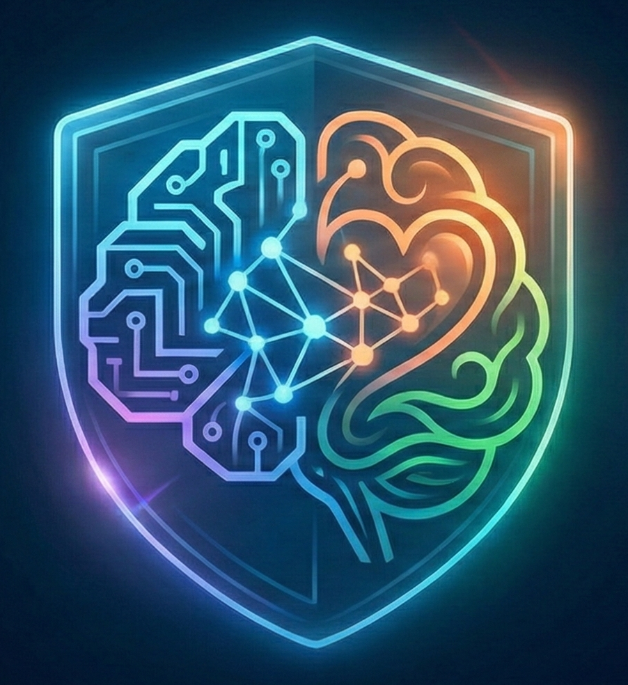

# 🛡️ NeuroDesk: Organizational Immune System

<div align="center">
  
  <br />
  <h1>NeuroDesk AI</h1>
  <p><strong>Resiliencia Técnica + Protección del Bienestar Humano</strong></p>
  
  
  
  
  
</div>

---

## 📖 Introducción

**El problema:** En el entorno corporativo actual, los equipos de TI y Recursos Humanos operan en silos. Cuando un sistema crítico falla, la presión recae sobre el empleado. El soporte técnico tradicional resuelve el ticket, pero ignora el costo humano. El resultado es un aumento silencioso del **Burnout**, rotación de personal y errores operativos graves.

**La solución:** **NeuroDesk** es el primer **Sistema Inmunológico Organizacional**. Es una plataforma agéntica impulsada por IA que fusiona la resolución técnica autónoma con la detección proactiva de saturación laboral.

No es solo un chatbot; es un orquestador que:
1.  **Escucha:** Procesa voz y texto con análisis de sentimiento en tiempo real.
2.  **Diagnostica:** Cruza datos de incidentes técnicos con métricas de carga laboral (HR).
3.  **Actúa:** Ejecuta automatizaciones reales en la infraestructura de Azure (Runbooks) o sugiere pausas operativas para proteger al usuario.

---

## 📖 PRESENTACION:
   
1. PPT: https://1drv.ms/p/c/8a8da2caafb2d58d/IQB1I7b0_28ZRYT1qrGneujlAcpg8LAxBHKQtQagXWNxjNY?e=cwnReQ 
2. Video Presentacion: https://1drv.ms/v/c/8a8da2caafb2d58d/IQD2uZk-MVB3SJ1m3uoxS0d8Afq4EYQfbx_MR7wlewC0Hpc?e=X9xdcP
3. 🚀 LIVE DEMO: [Probar NeuroDesk Aquí](https://nice-river-04ac3b80f.3.azurestaticapps.net)

---

## 🏗️ Arquitectura del Sistema

NeuroDesk utiliza una arquitectura **Cloud-Native** sobre Azure, implementando el patrón de **Multi-Agent Orchestration** con Semantic Kernel.


### Flujo de Datos:
1.  **Ingesta Multimodal:** El usuario interactúa vía Voz (Azure Speech) o Texto desde el Frontend alojado en **Azure Static Web Apps**.
2.  **Gateway Contenerizado:** La solicitud llega a **Azure Web App for Containers**, que descarga la imagen segura desde **Azure Container Registry (ACR)**.
3.  **Gateway de Seguridad:** **Azure Content Safety** filtra toxicidad antes de procesar.
4.  **Análisis Emocional:** **Azure AI Language** determina el sentimiento (Enojo, Frustración, Calma) para ajustar el tono de la IA.
5.  **Orquestación (Cerebro):** **Microsoft Semantic Kernel** con **GPT-5-chat** analiza la intención y selecciona el Plugin adecuado.
6.  **Ejecución de Agentes:**
    *   **HR Agent:** Consulta métricas en **Blob Storage** y **Cosmos DB**.
    *   **Policy Agent (RAG):** Busca vectorialmente normativas en **Azure AI Search**.
    *   **IT Agent:** Dispara Runbooks en **Azure Automation** o escala a humanos vía **Azure Logic Apps**.
7.  **Auditoría:** Cada decisión se registra en un Ledger inmutable en **Cosmos DB** (Serverless).

---

## ☁️ Servicios de Azure Utilizados

Este proyecto demuestra una integración profunda del ecosistema Azure:

| Servicio | Uso en NeuroDesk |
|----------|------------------|
| **Azure OpenAI Service** | Motor de razonamiento (GPT-5-chat) y generación de Embeddings (text-embedding-3-small). |
| **Azure AI Search** | Memoria a largo plazo (RAG) para búsqueda vectorial de políticas y manuales. |
| **Azure Cosmos DB** | Base de datos NoSQL para persistencia de tickets y Ledger de Auditoría (Logs). |
| **Azure Automation** | Ejecución de scripts PowerShell reales (Runbooks) para remediación técnica (reinicios, limpieza, etc.). |
| **Azure Speech Services** | Transcripción (STT) y Síntesis de voz (TTS) neuronal para accesibilidad. |
| **Azure AI Language** | Análisis de sentimiento para detectar frustración y modular la empatía del agente. |
| **Azure Content Safety** | Guardarraíles de IA Responsable para bloquear contenido dañino o ataques (Jailbreak). |
| **Azure Blob Storage** | Almacenamiento de datos maestros (HR) y evidencias de logs. |
| **Azure Logic Apps** | Orquestación de escalado humano (envío de alertas/emails a gerencia). |
| **Azure Document Intelligence** | OCR para extraer información de manuales en PDF/Imágenes durante la ingesta. |
| **Managed Identities** | Seguridad Zero-Trust para la comunicación entre servicios backend. |
| **Azure Static Web Apps** | Alojamiento global y distribuido del Frontend React + Vite. |
| **Azure Web App for Containers** | Ejecución del Backend Python en un entorno Serverless aislado. |
| **Azure Container Registry (ACR)** | Almacenamiento seguro de las imágenes Docker del sistema. |

---

## ✨ Características Clave

### 1. Detección de Riesgo "Human-in-the-Loop"
El sistema no solo ve "Error 500". Ve que el usuario "Frank" lleva 290 horas trabajadas este mes y tiene 3 tickets críticos hoy.
*   **Resultado:** En lugar de solo reiniciar el servidor, NeuroDesk sugiere aplicar la *Política de Desconexión*.

### 2. Automatización Real (No Simulada)
A diferencia de otras demos, NeuroDesk ejecuta **Runbooks de PowerShell reales** en Azure Automation:
*   `NeuroDesk-Self-Heal-Restart`: Reinicia Web Apps.
*   `NeuroDesk-Generate-Upload-Link`: Genera tokens SAS temporales para subida segura.
*   `NeuroDesk-Get-Activity-Logs`: Audita la suscripción en tiempo real.

### 3. IA Responsable y Ética
*   **Sanitización de Lenguaje:** El sistema tiene prohibido usar términos clínicos (ej. "depresión"), reemplazándolos por lenguaje operativo ("alta carga").
*   **Auditoría Completa:** Cada interacción queda registrada.
*   **Privacidad:** Los datos sensibles se manejan con IDs internos.

---

## 🧠 Motor de Datos y Simulación (ETL + GenAI)

NeuroDesk incluye un potente pipeline de ingesta y generación de datos para simular un entorno corporativo real desde el primer segundo:

1.  **Generación de Datos Sintéticos (Data Seeder):**
    *   Utilizamos **Azure OpenAI (GPT-5-chat)** para generar un historial de tickets de soporte realista.
    *   El script `data_seeder_ai.py` crea escenarios específicos (ej: "Burnout por exceso de horas", "Fallo de VPN") con descripciones en lenguaje natural, variaciones de tono y urgencia coherentes con el perfil del empleado.

2.  **Pipeline ETL para RAG (Memoria):**
    *   El sistema ingesta documentos no estructurados (PDFs de normativas, manuales en PNG).
    *   Utiliza **Azure Document Intelligence (OCR)** para extraer texto de imágenes y gráficos.
    *   Aplica *Chunking* inteligente y genera Embeddings vectoriales (`text-embedding-3-small`) que se indexan en **Azure AI Search**.

3.  **Inicialización de Cosmos DB:**
    *   Carga perfiles de empleados enriquecidos con métricas de RRHH (horas, satisfacción) para permitir la detección de riesgos.

---

## 🚀 Despliegue Cloud-Native (Azure)

NeuroDesk utiliza **Infrastructure as Code (IaC)** para aprovisionar los servicios cognitivos y contenedores.

### Prerrequisitos
*   Suscripción de Azure activa.
*   Azure CLI instalado (`az login`).
*   Docker Desktop (opcional).

### 0. Provisión de Infraestructura (IaC)

Utilizamos **Azure Bicep** para crear todos los servicios (IA, Datos, Web App, Static App) en una sola operación.

```bash
# 1. Crear Grupo de Recursos
az group create --name rg-neurodesk-project --location eastus2

# 2. Desplegar Infraestructura Completa
az deployment group create \
  --resource-group rg-neurodesk-project \
  --template-file infra/main.bicep \
  --parameters appName=neurodesk
```
> *Este comando crea el ACR, la Web App (Backend), la Static Web App (Frontend), Cosmos DB, OpenAI, etc. Al finalizar, revisa los "Outputs" para obtener las claves.*

### 1. Backend (Containerizado)

```bash
# 1. Subir la imagen al Container Registry (ACR) creado
# (El nombre del ACR está en los outputs del paso anterior o en el portal)
az acr build --registry <nombre-de-tu-acr> --image neurodesk-backend:latest .

# 2. Configurar Web App (Backend)
# Ve al Portal de Azure -> Web App -> Environment variables.
# Agrega las claves de tu .env (AZURE_OPENAI_API_KEY, etc.)
# IMPORTANTE: Asegúrate de que WEBSITES_PORT = 8000
```

### 2. Inicialización de Datos (Seed)

Una vez que la infraestructura está lista y las variables configuradas en tu entorno local (`.env`), ejecuta esto para "darle vida" al sistema:

```bash
python init_data.py
```
> *Este script indexa los manuales PDF en AI Search y carga tickets sintéticos en Cosmos DB.*

### 3. Frontend (Static Web Apps)

El recurso **Static Web App** ya fue creado por el script Bicep, pero está vacío. Conéctalo a tu código así:

1.  Ve al Portal de Azure y busca el recurso **Static Web App** (ej: `stapp-neurodesk...`).
2.  Haz clic en **"Manage deployment token"** y copia el token.
3.  Ve a tu repositorio en GitHub -> **Settings** -> **Secrets and variables** -> **Actions**.
4.  Crea un secreto llamado `AZURE_STATIC_WEB_APPS_API_TOKEN` y pega el token.
5.  En tu archivo de workflow en GitHub (`.github/workflows/azure-static-web-apps...yml`), asegúrate de que la variable de entorno del backend esté configurada:
    ```yaml
    env:
      VITE_API_URL: https://<nombre-de-tu-webapp-backend>.azurewebsites.net
    ```
6.  Haz un *push* a `main` para disparar el despliegue.

---

## 🧪 Guía de Demostración

El sistema incluye un modo de **Login Simulado** para demostrar diferentes perfiles sin depender de múltiples cuentas de Microsoft activas.

### Escenario A: Burnout Crítico
1.  Loguearse como **"Cristian Franko (UTN)"**.
2.  **Acción:** Usar el micrófono y decir: *"¡Odio este sistema, nada funciona y tengo mil cosas que entregar!"*.
3.  **Resultado:**
    *   Sentiment: Negativo 😡.
    *   Riesgo HR: Alto (detecta sobrecarga en CSV).
    *   **Respuesta:** Empática. Sugiere pausa y NO ejecuta acciones técnicas complejas para no estresar más.

### Escenario B: Falla Técnica Pura
1.  Loguearse como **"Franco O. (Dev)"**.
2.  **Acción:** Escribir: *"Todo está lento, necesito reiniciar el servicio web"*.
3.  **Resultado:**
    *   Riesgo HR: Bajo.
    *   **Acción:** Ejecuta `NeuroDesk-Self-Heal-Restart` en Azure.
    *   **Frontend:** Muestra spinner y confirma con ID de Job real.

### Escenario C: Auditoría y Logs
1.  Loguearse como **"Cristian F. (Admin)"**.
2.  **Acción:** Escribir: *"Necesito subir los logs del error"*.
3.  **Resultado:**
    *   Ejecuta `NeuroDesk-Generate-Upload-Link`.
    *   Devuelve un Widget visual para subir archivos reales a Blob Storage.

---

## 📂 Estructura del Proyecto

```text
neurodesk/
├── infra/                  # IaC con Bicep para desplegar recursos
├── neurodesk-frontend/     # SPA React + Vite + Tailwind
│   ├── src/
│   │   ├── components/     # Dashboard, Chat, Widgets
│   │   ├── store/          # Estado global (Zustand)
│   │   └── ...
├── src/                    # Backend Python FastAPI
│   ├── api/                # Endpoints (REST)
│   ├── data/               # Datasets semilla (HR, Políticas)
│   ├── models/             # Modelos Pydantic
│   ├── services/           # Lógica de Negocio
│   │   ├── plugins/        # Agentes Semánticos (HR, IT, Policy)
│   │   ├── chat_orchestrator.py  # Cerebro principal (Semantic Kernel)
│   │   ├── safety_guard.py       # Filtro de Contenidos
│   │   └── ...
│   └── utils/              # Loggers y helpers
├── init_data.py            # Script ETL (Carga inicial de datos)
└── requirements.txt        # Dependencias Python
```

---

## 🤝 IA Responsable

NeuroDesk ha sido diseñado siguiendo rigurosamente los 6 principios de IA Responsable de Microsoft:

1.  **⚖️ Equidad:**
    Al utilizar *Azure AI Language* para analizar el sentimiento, el sistema prioriza la atención basándose en la urgencia emocional y la carga real del empleado, asegurando un trato justo para todos, independientemente de su cargo o jerarquía.

2.  **🛡️ Confiabilidad y Seguridad:**
    Hemos blindado el gateway con *Azure Content Safety* para filtrar entradas maliciosas y diseñamos nuestros agentes con lógica de recuperación automática ante fallos de infraestructura (Self-healing).

3.  **🔒 Privacidad y Seguridad:**
    Protegemos los datos utilizando **Identidades Administradas de Azure** (Managed Identities) para que no existan credenciales en el código fuente. Los datos sensibles de recursos humanos se procesan bajo estrictos protocolos de acceso RBAC.

4.  **♿ Inclusión:**
    Gracias a la integración de *Azure Speech Services*, NeuroDesk permite una interacción completa mediante voz, empoderando a personas con diversidades funcionales o a operarios que no pueden utilizar sus manos para escribir.

5.  **👁️ Transparencia:**
    Nuestra interfaz elimina el efecto de "caja negra" mostrando en tiempo real, en el panel lateral "Live Intelligence", exactamente qué herramienta está utilizando la IA y por qué, para que el usuario siempre comprenda cómo se toman las decisiones.

6.  **🤝 Responsabilidad:**
    Las personas siempre tienen el control. Implementamos un sistema de supervisión mediante **Azure Logic Apps** que escala automáticamente situaciones de crisis o ambigüedad a un humano, asegurando que la IA nunca tome decisiones críticas de forma aislada.

---

## 👥 Equipo

*   **Cristian Franko** - Arquitectura Cloud & Backend AI
*   **Fabio Arias** - Frontend & AI

---

> *Este proyecto fue desarrollado para la Microsoft Azure Hackathon 2025.*
